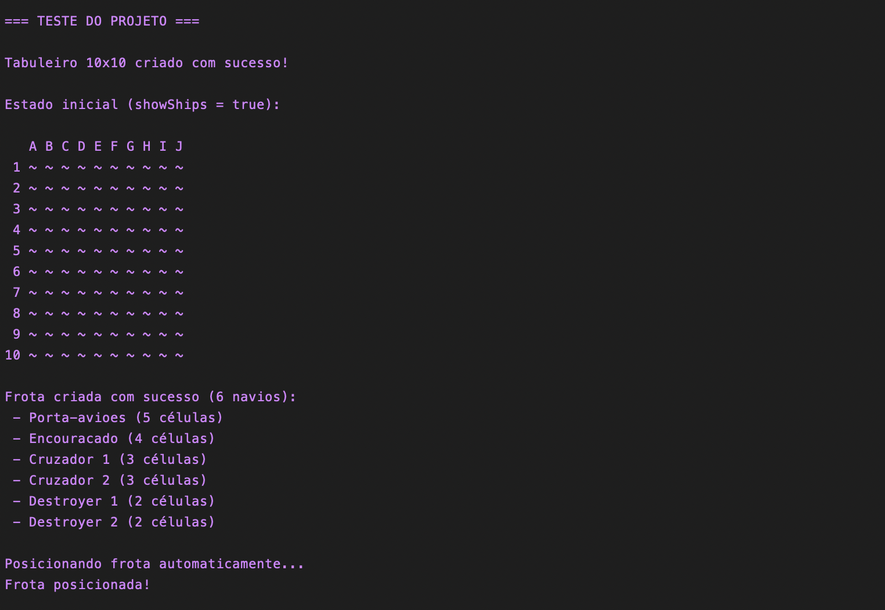

# Batalha Naval
Projeto desenvolvido para a disciplina **PIF – Sistemas de Informação** (CESAR School).

## Integrantes
- Maria Clara Targino  
- Nádia Bordoni  
- Pedro Gabriel Paes

## Resumo
Implementação do jogo Batalha Naval em C, com foco em:
- structs e ponteiros
- alocação dinâmica
- modularização (módulos: board, fleet, game, io, random)

## Funcionalidades
- Tamanho de tabuleiro configurável (NxN, quadrado)
- Posicionamento de navios:
  - Automático (aleatório)
  - Manual (via CLI)
- Jogo por turnos com exibição de:
  - Tabuleiro próprio (com navios)
  - Visão parcial do tabuleiro inimigo (apenas hits/misses)
- Exibição de vencedor e estatísticas ao final (tiros, acertos)

## Como compilar
Recomendado: usar o `Makefile`.

Na raiz do projeto:
```bash
make
```
---
## Testes de funcionamento
Testes parciais foram feitos 23/11 e no dia 24/11:



Testes finais feitos 01/12:
